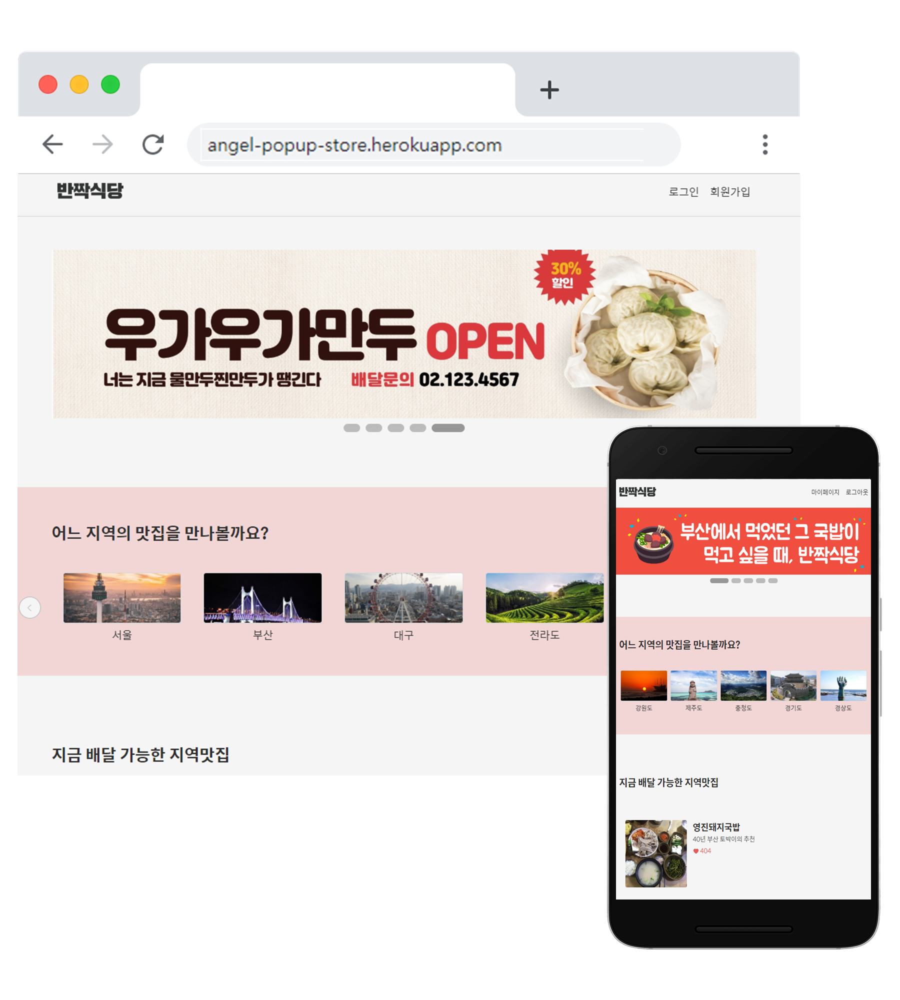

# Team N뽀 - Frontend

 

## 전국 맛집 팝업 스토어 서비스 : 반짝식당

Backend Repository : https://github.com/yumjuice/angel 
API Docs: https://github.com/yumjuice/angel/wiki/API 

### [Demo](https://angel-popup-store.herokuapp.com/)

## Skills

### Frontend

- React

### Backend

- Node.js
- Mysql

## 기능

### Account(계정)

- 로그인
- 회원가입
- 마이페이지

### Shopping(맛집 검색 및 주문)

- 지역별 카테고리
- 가게 상세 페이지
- 장바구니
- 관심 목록 추가
- 결제 화면

## React Boilerplate

This project was bootstrapped with [Create React App](https://github.com/facebook/create-react-app) and [craco](https://github.com/gsoft-inc/craco).

## Used Library from NPM

- Pure Carousel Slider : [Pure-react-carousel](https://www.npmjs.com/package/pure-react-carousel)
- HTTP client: [Axios](https://www.npmjs.com/package/axios)
- Syntactically Awesome Style Sheets: [Sass](https://www.npmjs.com/package/node-sass)
